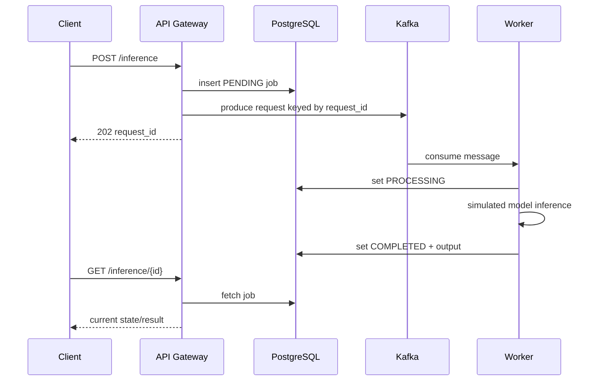

# Architecture notes

## Request sequence

## Failure semantics

The service provides at-least-once processing. The producer waits for Kafka acknowledgement; if all retries fail, the created job becomes `FAILED` and the caller receives `503`. The consumer deliberately leaves transiently failed messages uncommitted. Redelivery is harmless because the durable status is checked first and completed jobs are not re-run. Invalid messages are logged and committed to prevent a poison-message loop.
